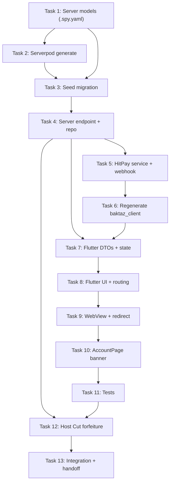

# Host Subscription Feature Implementation Plan

> **Parent Canonical Roadmap:** Governed by and aligned with the Master Integration Plan in [`/Users/Arnold/Projects/baktaz/docs/superpowers/plans/2026-08-30-master-integration-plan.md`](../2026-08-30-master-integration-plan.md).
> All models, paths, and invariants (HitPay recurring card billing, strict server-side entitlement check for Premium Host Cut, 10% host fee forfeiture rule on expired subscription, Serverpod 2.x RPC boundary input validation, `session.auth.authenticatedUserId` identity derivation, Pattern B error handling, `TaskResult<T>` repository returns, and implementation-first testing workflows) strictly conform to the master roadmap.

> **For agentic workers:** REQUIRED SUB-SKILL: Use superpowers:subagent-driven-development (recommended) or superpowers:executing-plans to implement this plan task-by-task. Steps use checkbox (`- [ ]`) syntax for tracking.

**Goal:** Enable users to upgrade from Free Regular User to Subscribed Premium Host via HitPay recurring card billing, with optional voucher support. Premium Host entitlement to Host Cut enforced via strict server-side subscription status check.

**Architecture:** Server-side Serverpod endpoint with HitPay recurring billing API integration. Flutter UI with cubit state management, hybrid checkout flow (app plan/voucher selection → HitPay hosted card page via WebView). Subscription packages and vouchers stored in database with seed data.

**Tech Stack:** Serverpod 2.x, HitPay Recurring Billing API (Cards only), fpdart, freezed, bloc_signals, go_router, webview_flutter

**Spec:** `docs/superpowers/specs/account/subscription/2026-08-29-00-overview.md`

## Global Constraints

- Flutter: `very_good_analysis` + `dart_code_metrics` with `--fatal-infos`, line length 120, `fpdart`, `freezed`, `bloc_signals`, `go_router`
- Serverpod: 2.x, Serverpod codegen order: `.spy.yaml` → `serverpod generate` → migrations
- Server: No raw SQL, no hardcoded user-facing strings (exception: `*_server` allowed)
- Voucher codes: uppercase alphanumeric, human-readable
- HitPay: Cards only (Visa/Mastercard), recurring billing via hosted checkout
- Platform absorbs all processing fees + VAT
- No refunds: cancellations take effect at period end

## Sub-Plan Documents

| Part | File | Focus |
|---|---|---|
| 1 | `2026-08-29-01-task-01-server-models.md` | `.spy.yaml` models + Serverpod codegen |
| 2 | `2026-08-29-02-task-03-seed-migration.md` | Seed data migration |
| 3 | `2026-08-29-03-task-04-server-endpoint-repos.md` | Endpoint + repo interfaces |
| 4 | `2026-08-29-04-task-05-hitpay-service-webhook.md` | HitPay service, webhook, checkout impl |
| 5 | `2026-08-29-05-task-06-client-regen.md` | Regenerate baktaz_client |
| 6 | `2026-08-29-06-task-07-flutter-cubit-state.md` | Flutter DTOs, repo, cubit, state |
| 7 | `2026-08-29-07-task-08-ui-routing.md` | Screen, widgets, GoRouter route |
| 8 | `2026-08-29-08-task-09-webview.md` | HitPay checkout WebView |
| 9 | `2026-08-29-09-task-10-banner-update.md` | AccountPage banner + AccountSummary |
| 10 | `2026-08-29-10-task-11-tests.md` | Unit tests |
| 11 | `2026-08-29-11-task-12-hostcut-integration.md` | Host Cut forfeiture in Challenge |
| 12 | `2026-08-29-12-task-13-integration-handoff.md` | Final sync, analyze, test |

## Task Dependencies Map

